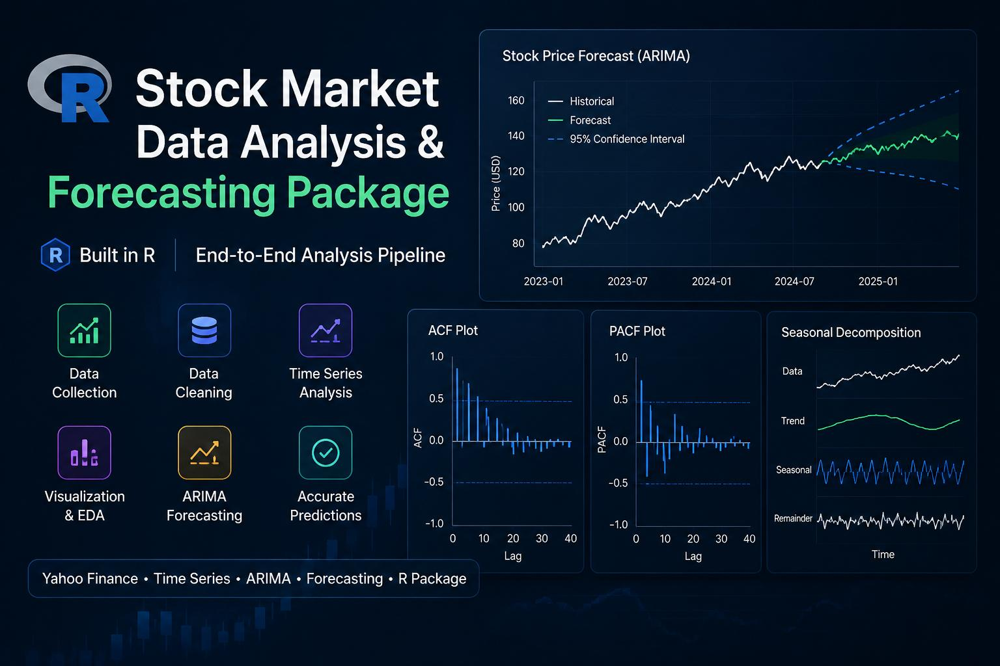
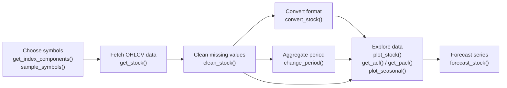
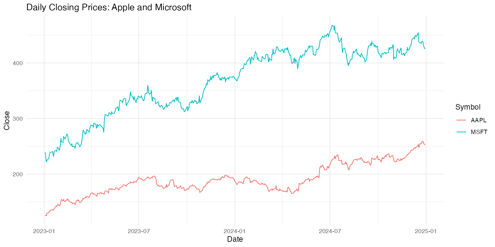
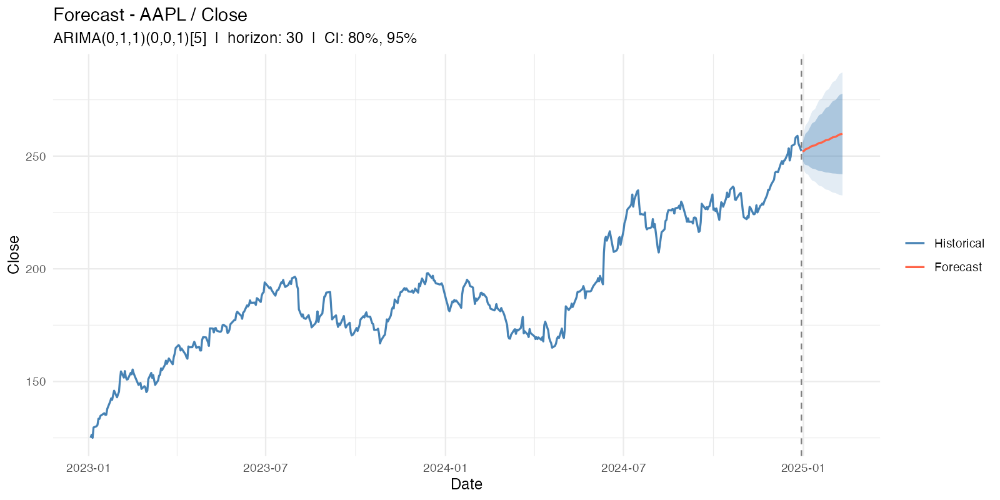

# MISdata

<!-- badges: start -->
[](https://github.com/MISDataGit/MISdata/actions/workflows/R-CMD-check.yaml)
[-blue.svg)](https://www.gnu.org/licenses/gpl-3.0)
[](https://lifecycle.r-lib.org/articles/stages.html#experimental)
<!-- badges: end -->

End-to-end pipeline for stock market data analysis in R.

[Installation](#installation) · [Examples](#examples) · [Function Reference](#function-reference) · [User Manual](https://github.com/MISDataGit/MISdata/wiki)

## Overview

`MISdata` provides a complete workflow for retrieving, cleaning,
transforming, and analyzing stock market data. The package fetches
index constituents from Wikipedia and OHLCV history from Yahoo Finance,
then offers utilities for NA handling, time-series format conversion
(via `tsbox`), period aggregation with OHLCV-aware semantics,
exploratory analysis (line plots, ACF/PACF, STL decomposition), and
ARIMA-based forecasting with multi-level confidence bands.

<p align="center">
  
</p>

This package was developed as part of an undergraduate project.
It is not intended for CRAN submission but follows CRAN-compatible
standards.

## Workflow



## Installation

Install the latest stable version from GitHub:

```r
# install.packages("remotes")
remotes::install_github("MISDataGit/MISdata")
```

## Examples

The examples below use Apple and Microsoft closing prices from
January 1, 2023 through December 31, 2024.

### Retrieve and visualize stock data

```r
library(MISdata)

symbols <- c("AAPL", "MSFT")

stocks <- get_stock(
  symbols = symbols,
  start = "2023-01-01",
  end = "2024-12-31",
  columns = "Close"
)
stocks <- clean_stock(stocks, na_method = "trim")

history_plot <- plot_stock(
  stocks,
  symbols = symbols,
  column = "Close",
  title = "Daily Closing Prices: Apple and Microsoft"
)
history_plot
```



### Forecast a stock series

```r
apple_forecast <- forecast_stock(
  stocks,
  symbol = "AAPL",
  column = "Close",
  horizon = 30,
  ci_levels = c(80, 95)
)

summary(apple_forecast$model)
apple_forecast$plot
```



The forecast chart includes the fitted ARIMA model, a 30-step point forecast,
and 80% and 95% confidence intervals.

To regenerate both README images from the package source:

```sh
Rscript tools/generate-readme-images.R
```

## Function Reference

The package is organized into six modules:

| Module | Functions | Purpose |
|---|---|---|
| `fetch.R`    | `get_index_components()`, `sample_symbols()`, `get_stock()` | Retrieve index constituents and OHLCV data |
| `clean.R`    | `clean_stock()` | Group-wise NA handling on long data frames |
| `convert.R`  | `convert_stock()` | Convert between long df, xts, tsibble, zoo, ts |
| `period.R`   | `change_period()` | OHLCV-aware period aggregation |
| `eda.R`      | `plot_stock()`, `get_acf()`, `get_pacf()`, `plot_seasonal()` | Visualization and autocorrelation analysis |
| `forecast.R` | `forecast_stock()` | ARIMA forecasting via `forecast::auto.arima()` |

For complete usage instructions, read the
[MISdata User Manual](https://github.com/MISDataGit/MISdata/wiki), or install
the package and run `?MISdata` or `?<function_name>`.

## Authors

- Batuhan Karaköy
- Enes Türkoğlu
- Metehan Kaygısız

## License

GPL (>= 3). See [LICENSE.md](LICENSE.md) for the full text.
